# KimiUso FanPage ( *unofficial* )

> [!NOTE] This project is not intened for commercial gain, but rather for educational
> and academic purpose.

This [repository][repo-link] contains the source code of 1st Semester
**Final Project** for FrontEnd Development Lab conducted by *Professor **Maya Thapa***.
The project showcases the practical application of concepts and skills acquired during
the course, including **HTML**, **CSS** and *JavaScript*[^1]. It represents our progress
and learning journey in the fields of frontend development under *Professor Maya
Thapa*.

> [!IMPORTANT]
> This repository has undergone some changes after the project submisson was made.
> If you are here for project evaluation please view: [b83b89e](https://github.com/skarFubatsu/kimi-uso-fan-page/tree/b83b89ee82b9292f38a043d2aee1373728434575
> "Code submitted as hard copy")

## Introduction

This GitHub project is a tribute to the beloved anime, inspired by the captivating
characters and the soul-stirring melodies that resonate within the hearts of the
fans. Dive into the essence of **"Shigatsu wa Kimi no Uso"** with this *Front-End
Project* that brings the magic of the anime to life. Immerse yourself in the visually
appealing and thematically rich design, celebrating the profound connections and
relatable emotions portrayed by the characters.

As a fan, I couldn't resist the urge to create a space that pays homage to the anime's
profound impact on emotions and relationships. The characters' journeys are not just
stories; they are echoes of our own experiences, making this project a heartfelt
exprssion of admiration.

___

## Screenshots

### Home

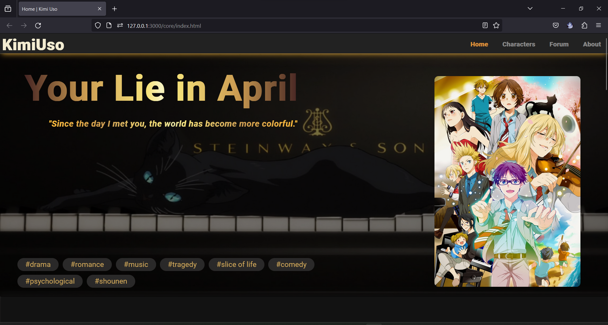

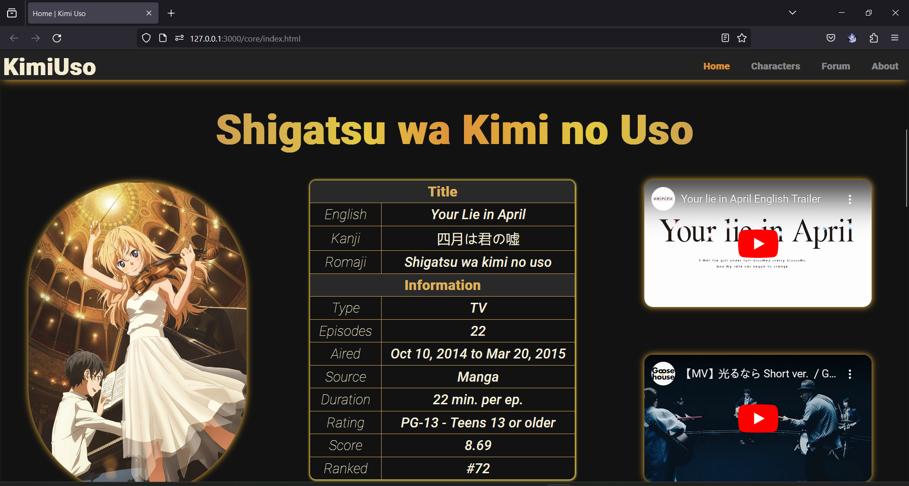

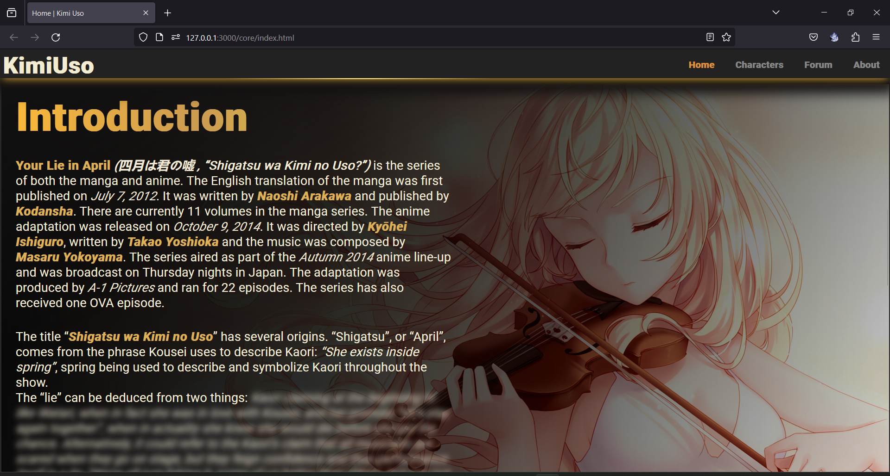

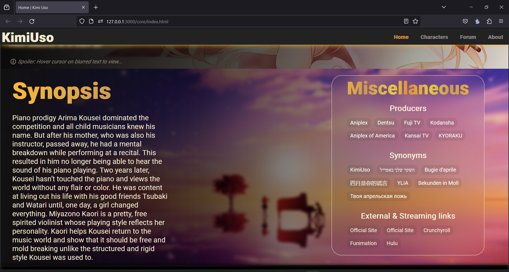

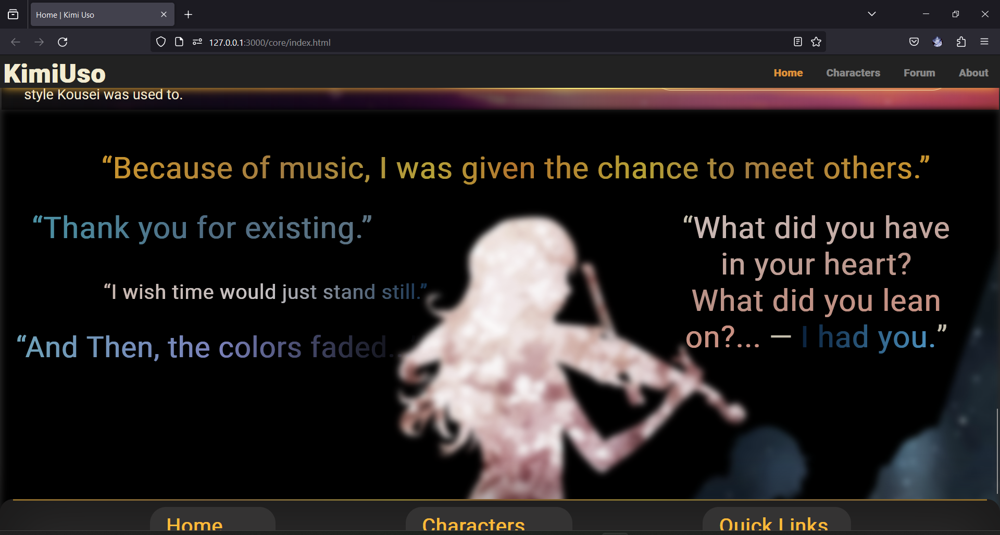

### Characters

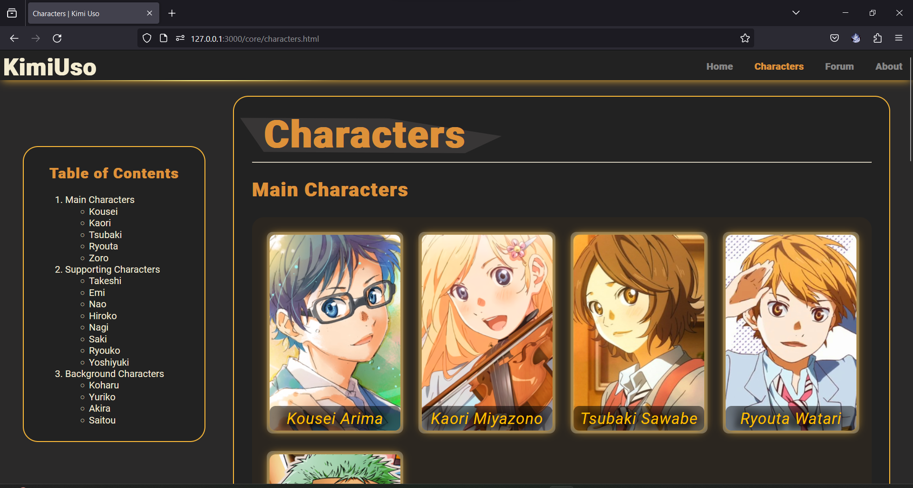

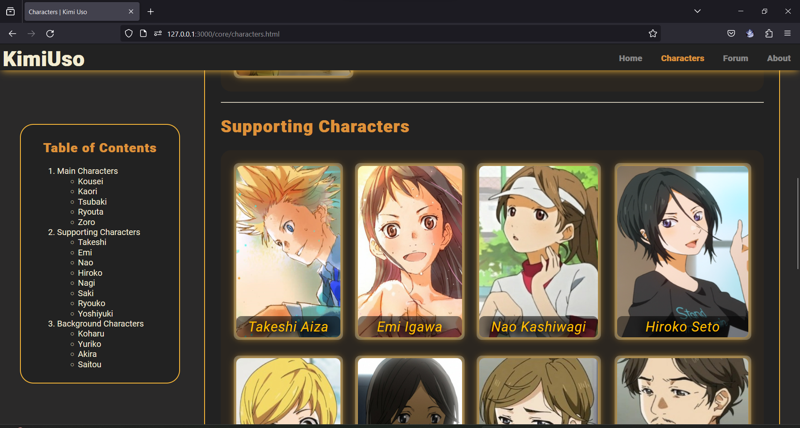

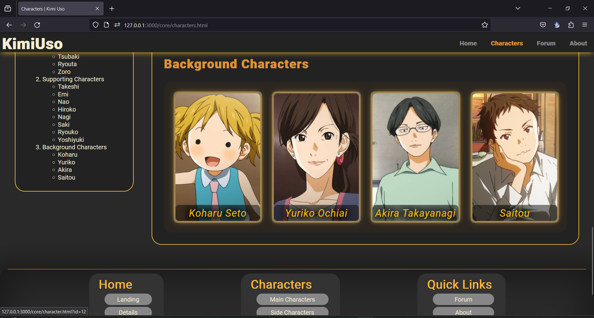

#### Character Information

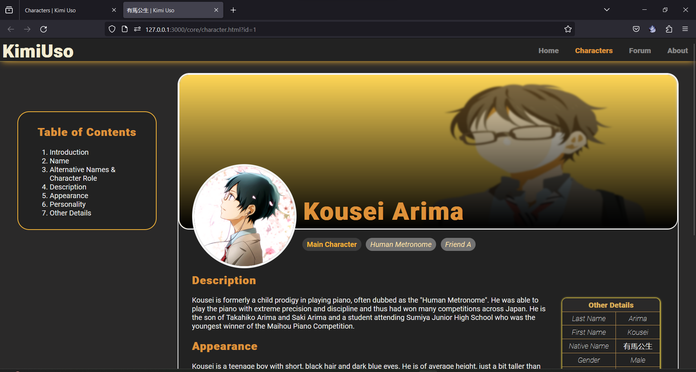

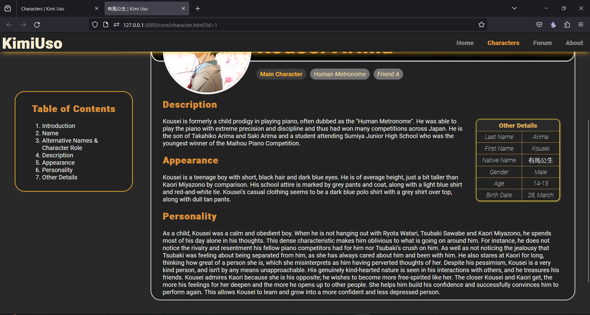

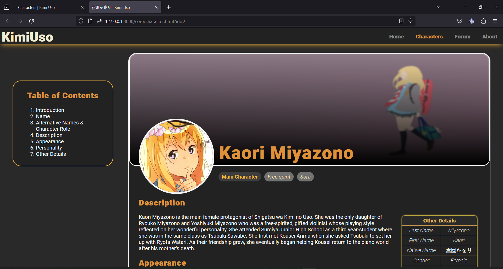

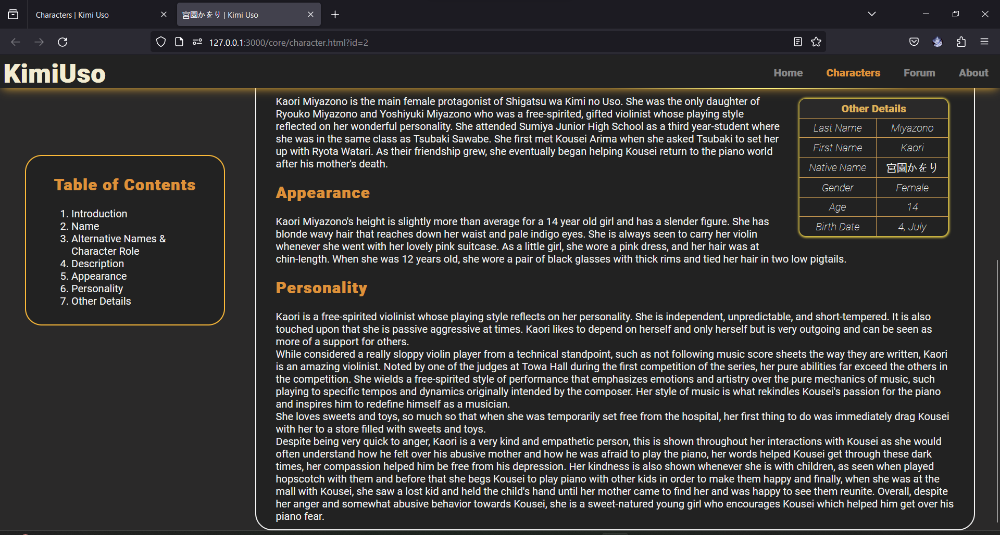

### Forum

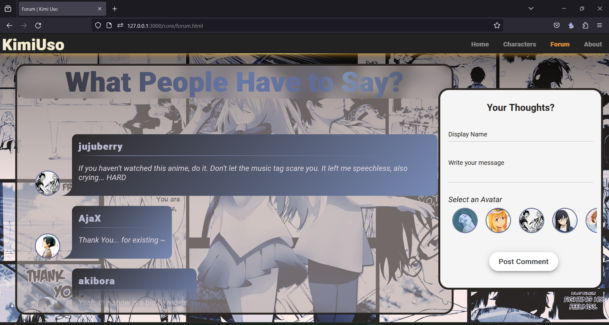

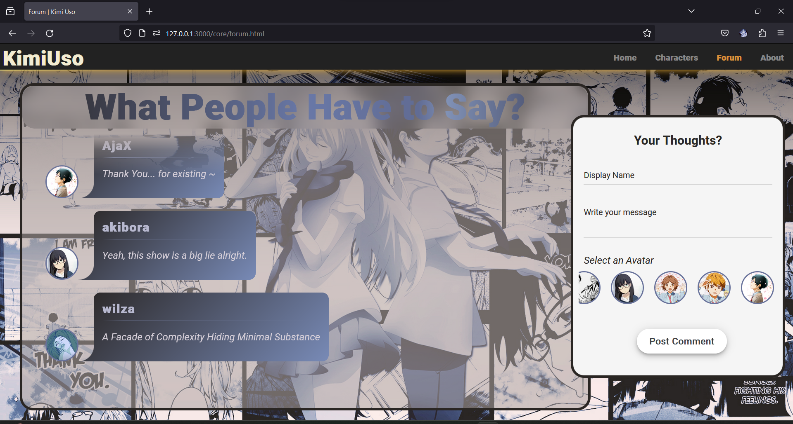

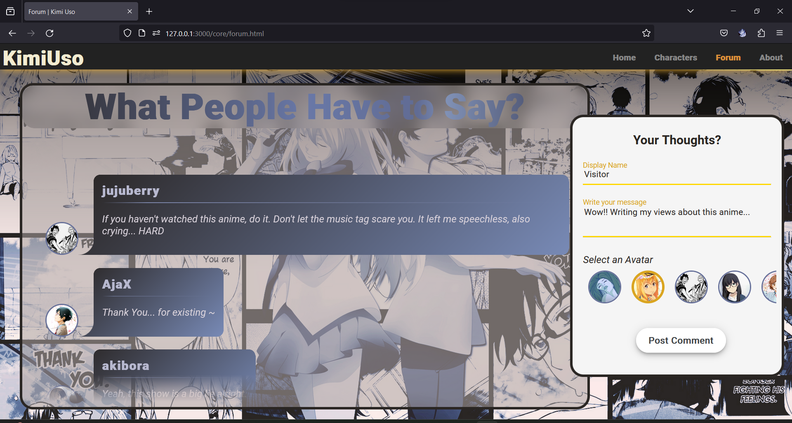

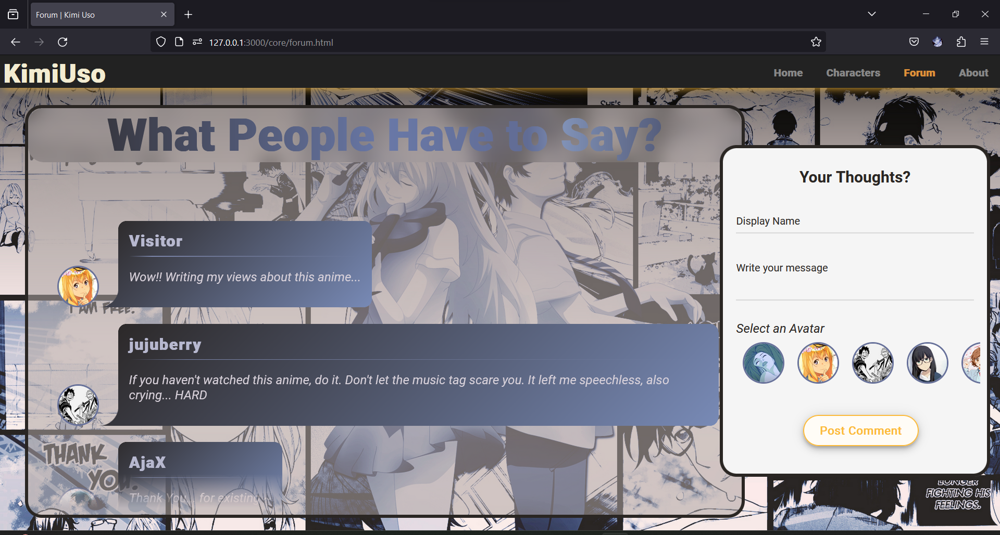

### About

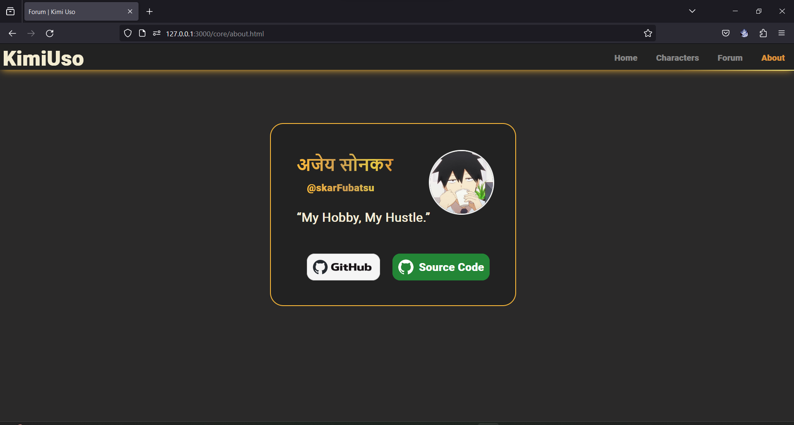

___

[repo-link]: https://github.com/skarFubatsu/kimi-uso-fan-page "Kimi Uso FanPage"

[^1]: While JavaScript wasn't included in the curriculum for the current semester, I
took the initiative to learn and implement it to enrich my project.
